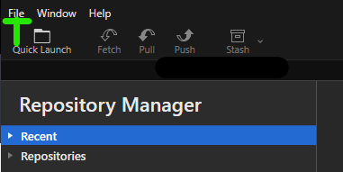
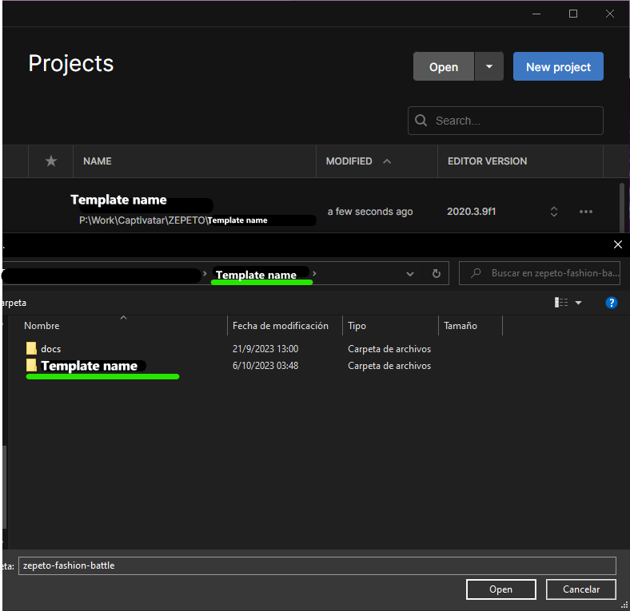
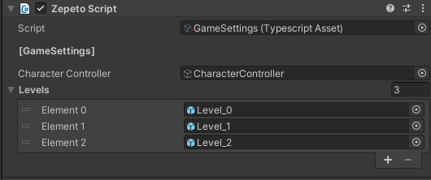
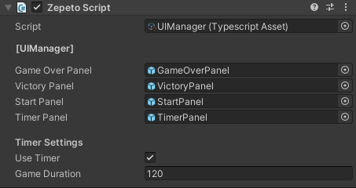
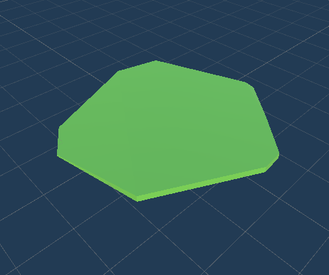
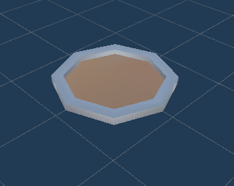

# Obby Template

## 📢 About
Nice to meet you Creators! 👋 Welcome to Obby template guide!   
With Obby you can create amazing parkour worlds to play with your friends!   
Now, are you ready to get started?   

## Overview
The Obby Template is a ready-to-use template for creating obstacle course (Obby) games in Unity. It provides a set of prefabs, scripts, and assets that can be easily customized to create unique and challenging obstacle courses for players to navigate through.
  

## ❓ How to create with Obby template
:wrench: Installation and settings

- If you haven't install the Zepeto World you can check how to do it  <a href="https://docs.zepeto.me/studio/reference/installation_and_settings">Here!</a>

- Once you have installed Zepeto, you have to pull this repository and you can do it in 3 ways
  - [Cloning it](#cloning-the-project)
  - [Downloading it](#downloading-the-project)
  - [By Unitypackage](#getting-it-from-the-releases-section)

### Cloning the project

First we go to the [Code] button and click it.

 </img> 

Then click on the icon to copy the link of the repository (make sure that you are on the https tab) or copy it manually.

 </img> 

Once you have it, using your your preferred software (in this case we are using <a href="https://git-fork.com/" target="_blank"> Fork</a>) click on "File->Clone" or press "Ctrl + N" to clone.

 </img> 

Here we fill the URL tab and set the folder where you want to save it and press clone.

 </img> 

Once it clones the project you can open it from Unity Hub.  

### Downloading the project

Click on the same [Code] button but instead of clicking on the link, click on download zip

 </img> 

Then extract the files and open it with Unity.  

### Getting it from the releases section

Go to the releases section or click in the latest release.

 </img> 

Then click on the file ".unitypackage" and import it in a new project of Unity!

 </img> 

> 💡 Enjoy and start creating with the Template! :tada:
 

## ❓ FAQ

How to open the project 

Select the template folder and it will open the project.
 </img>

To open a Unity project for the first time, follow these steps:

1. Launch Unity Hub.
2. In Unity Hub, click on the "Projects" tab on the left side.
3. Click on Add: If your project is not already listed, click on the "Add" button to add your project to the list. Navigate to the folder where your Unity project is located and select the folder. Click "Open" to add the project to Unity Hub.
4. Select Project: Once your project is added to the list, click on it to select it.
5. Wait for Unity to Load: Unity will now open your project. This may take some time depending on the size of your project and your computer's performance.
6. Project Opened: Once Unity has finished loading, your project will be opened and ready for you to work on.

How to play 
 
Before you press play to test the template you have to open the scene.  

 To play the game template in Unity, follow these steps: 

1. Open the Scene: First find the scene in the next folder and open it.
 </img>  
2. Play the Template: then you can press [Play] to test the template.

 How to change variables
 

To make changes in the game you can go in the Hierarchy and select the "Managers" folder there are the most customizables settings for the template.

 </img>
 

 To change variables in Unity, follow these steps:

1. Open the Hierarchy: In the Unity Editor, locate and click on the "Hierarchy" tab at the top of the screen.
2. Select the "Managers" Folder: In the Hierarchy window, find and click on the "Managers" folder. This folder contains the most customizable settings for the template.
3. Modify Variables:  With the "Managers" folder selected, you can now modify the variables and settings for the template as needed.
4. Save Changes: After making your changes, remember to save the scene by clicking on "File" > "Save Scene" in the Unity Editor.

  

## 🔨 Tools
  

 GameSettings
  
General game statistics and settings

                    
| Name     | Functionality                                                             |
| -------- | ------------------------------------------------------------------------- |
| `Levels` | This is the list of level prefabs, they appears on the order of the list. |

 
  </img>   
 

 

UI Manager
 
 
General game statistics and settings
Have the UI references and the configuration for the user of the timer.

------------------------------------------------------------------------------------------------------------
| Name              | Functionality                                                               |
| ----------------- | --------------------------------------------------------------------------- |
| `Game Duration`   | Total time that the game lasts, after this time a game over screen appears. |
| `Use Timer`       | If this value is true, a timer will appear on your screen                   |
| `Timer Panel`     | Reference to the timer panel object, it is on the Game Canvas.              |
| `Victory Panel`   | Reference to the victory panel object, it is on the Game Canvas.            |
| `Game Over Panel` | Reference to the Game Over panel object, it is on the Game Canvas.          |
| `Start Panel`     | Reference to the Start panel  object, it is on the Game Canvas.             |

  </img>  
  

ObbyManager
 

 This script is very important for the functioning of the Obby template. Check that it is in scene.

 

## 🚧 Builds

- <h3>Spawn Platform:</h3>
 This is the first platform, it is used as the base of spawn. 
 </img>    

- <h3>Death Road:</h3> 
This is a sample for the death system.  
 </img> 
 </img>     

- <h3>Teleport:</h3>
This is responsible for sending the player to the last saved position. You can edit the hitbox with the box collider 
 </img>     

- <h3>Fall Platform Builder:</h3>
 </img> 

Use the ***FallPlatformBuilder*** component to build platforms that fall. 
Add it to the scene and then add the object you want as a child of the prefab.

Make sure the object you add contains the BoxCollider component with the
corresponding dimensions of the object.
  </img>  

Additionally, make sure that the object does not have the Static option enabled.
  </img>  

#### *Fall Platform Structure:* 

 </img>    

|                        |                                                                                              |
| ---------------------- | -------------------------------------------------------------------------------------------- |
| `Box Collider`         | Used to detect the player                                                                    |
| `Rigidbody`            | Used to realize the fall of the platform                                                     |
| ` FallPlatform Script` | **Fall Delay:** Time it takes to start falling.  **Respawn Delay:** Time it takes to respawn |
 

- <h3>Goal Platform:</h3>
 This platform is used as a goal, add it at the end of the level.
When the player passes over it a victory tab will appear.
 </img>  

- <h3>Move Platform:</h3>
 </img>  
This platform can move along any axis setting the amount of movement that you want to the platform do and in how much time it takes to go back.
 </img>  

- <h3>Level Prefab:</h3>
You can find this prefab to create new levels, make a copy and work with the copy so you can make a lot of new levels from the base.
 </img>  
 </img>  
The level prefab contains a complete level, wich will be added to the "Levels"  array in "GameSettings".
Also the prefab have a "Level" script that have the SpawnPoint of the level.
 </img>   

- <h3>Check Point Prefab:</h3>
This is a empty gameObject that will be the check point to teleport the player when he loses. Check Point Prefab is part of a Spawn Platform.
 </img>  

   

## :point_right: You can easily modify this:

<h3>Level Prefab:</h3>

 </img>    

1. Locate the Level Prefab:
 - In your Unity project, navigate to the folder where the Level Prefab is located. This prefab is used to create new levels in your game.

2. Create a Copy of the Level Prefab:
- Right-click on the Level Prefab and select "Duplicate" or "Copy".
- Paste the duplicate copy in the same folder or a new folder where you want to work on the new level.

3. Modify the Copied Prefab:
- Select the copied prefab in your Unity project.
- Rename the copied prefab to indicate that it is a new level.
- Open the copied prefab in the Prefab Editor.

4. Customize the New Level:
- Add platforms prefab.
- Edit Platform Positions: Select the platforms in the scene and use the Move tool (shortcut key W) to adjust their positions. You can also rotate them using the Rotate tool (shortcut key E).
- Add Details: Add other elements like obstacles, decorations, or characters to your world to make it more interesting and engaging.
- Make changes to the level layout, decorations, obstacles, etc., as desired for your new level.
- Ensure that the new level prefab is unique and distinct from the original prefab.

5. *Configure the Level Script:
- The Level Prefab should have a "Level" script attached to it. 
- Open the Level script. The prefab have a "Level" script that have the SpawnPoint of the level.

6. Add the New Level to Game Settings:
- In your Unity project, locate the "GameSettings"
- Add the new level prefab to the "Levels" array in the "GameSettings" to include it in the game's level selection or progression.

7. Test the New Level:
 - Save your changes and run the game in the Unity Editor.
- Test the new level

8. Repeat for Additional Levels:
   - If you want to create more new levels, repeat the above steps starting from creating a copy of the Level Prefab.

9. Save Your Work:
   - Save all your changes:
   (Save the prefab by clicking the "Apply" button in the Prefab Editor.
   Save Your Scene:  save the scene by going to "File" > "Save Scene" and give it a name.)

10. Iterate and Refine:
   - Continue iterating on your levels, refining the design, and playtesting to ensure a fun and engaging experience for players.

<h3>UI Prefabs</h3>
You can edit every panel of each part of the game from their own prefab.
You can found them in the project folder.

  To modify UI prefabs in Unity, follow these steps:
1. Locate the UI prefab you want to modify. You can find prefabs in the project folder under the "Prefabs" directory or in a specific folder for UI elements.
2. Double-click on the UI prefab to open it in the Prefab Editor.
3. In the Prefab Editor, you can modify the UI elements as needed. This may include changing text, images, layouts, or adding/removing components.
4. Once you have made your modifications, save the prefab by clicking the "Apply" button in the Prefab Editor.
5. To apply the changes to instances of the prefab in your scene, select each instance and click the "Apply" button in the Inspector window.
6. Test your changes in Play mode to ensure they work as expected.
7. If you need to make further modifications, repeat the above steps.

